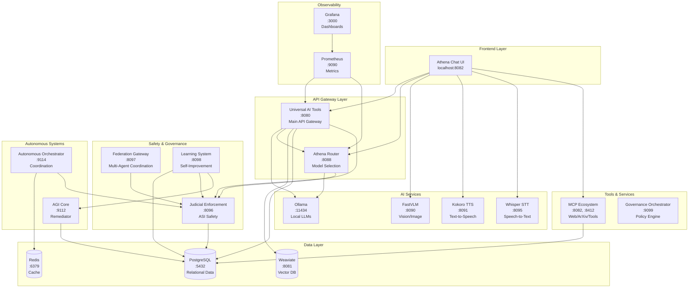
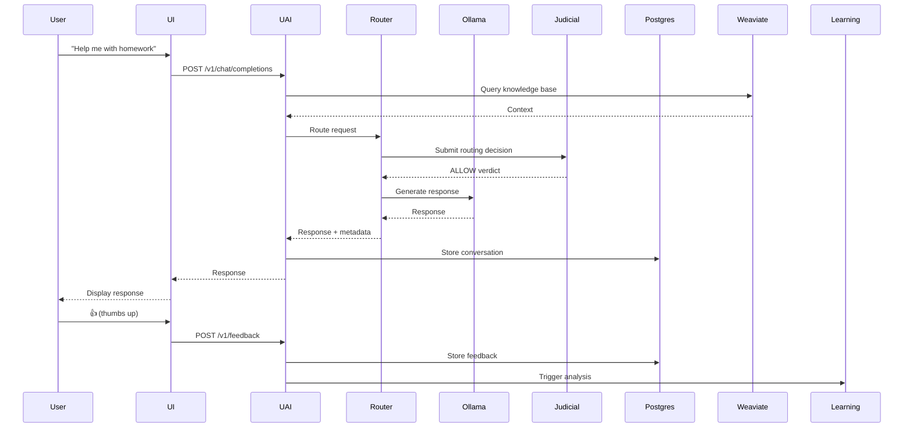

# 🗺️ ATHENA API ARCHITECTURE - COMPLETE MAP

---

## 📊 COMPLETE API ENDPOINT INVENTORY

### 🎯 **UAI (Universal AI Tools) - :8080**

#### Chat & Completion:
- `POST /v1/chat/completions` - Main chat endpoint (with RAG)
- `GET /v1/models` - List available models
- `GET /health` - Health check

#### User Feedback:
- `POST /v1/feedback` - Submit user feedback (👍 👎)
- `GET /v1/feedback/stats` - Feedback statistics

#### Real-time:
- `WS /v1/realtime/feedback` - WebSocket feedback streaming

#### RAG & Knowledge:
- Internal: Enhanced RAG with Weaviate
- Internal: Historical context (conversation, preferences, tasks)

#### Family Features:
- `GET /api/tasks` - List family tasks
- `POST /api/tasks` - Create task
- `GET /api/tasks/{id}` - Get specific task
- `PUT /api/tasks/{id}/complete` - Complete task
- `GET /api/users` - List family members
- `GET /api/users/{id}` - Get family member
- `POST /api/users` - Create family member

#### TTS:
- `POST /api/tts/synthesize` - Text-to-speech

---

### 🧠 **Router - :8088**

#### Routing:
- `POST /route` - Route request to best model
- `GET /health` - Health check
- `GET /metrics` - Prometheus metrics

#### Advanced Features:
- Internal: Load balancing
- Internal: Circuit breakers
- Internal: Fallback mechanisms
- Internal: ECE (Expected Calibration Error) gating
- Internal: Judicial oversight integration

---

### 👁️ **FastVLM (Vision) - :8090**

- `POST /generate` - Image analysis/captioning
- `GET /health` - Health check

---

### 🔊 **Kokoro TTS - :8091**

- `POST /synthesize` - Text-to-speech
- `GET /health` - Health check
- `GET /voices` - List available voices

---

### 🎤 **Whisper STT - :8095**

- `POST /transcribe` - Audio-to-text transcription
- `GET /health` - Health check

---

### ⚖️ **Judicial Enforcement - :8096**

#### Adjudication:
- `POST /v2/judicial/adjudicate` - Submit event for judicial review
- `GET /v2/judicial/verdicts` - Get verdict history
- `GET /v2/health` - Health check

#### Audit:
- `POST /v2/judicial/audit` - Log audit event
- `GET /v2/judicial/audit/log` - Get audit log

#### Features:
- Severity-based verdicts (ALLOW, WARN, DENY, TRIBUNAL)
- Human tribunal escalation
- Constitutional compliance checks
- Tamper-proof audit logs

---

### 🌐 **Federation Gateway - :8097**

- `GET /federation/health` - Health check
- `GET /federation/status` - Federation status
- `POST /federation/register` - Register AI agent
- Internal: Multi-agent coordination

---

### 🧠 **Learning System - :8098**

#### Learning Cycles:
- `POST /v1/learning/run` - Run full learning cycle
- `POST /v1/learning/trigger` - Trigger specific agent
- `GET /v1/learning/history` - Get learning history
- `GET /health` - Health check

#### Agent-Specific:
- `POST /v1/feedback/analyze` - Analyze user feedback
- `POST /v1/router/learn` - Router learning
- `POST /v1/autonomous/improve` - Autonomous improvement

#### Features:
- 7 specialized learning agents
- Parallel execution
- Knowledge synthesis
- Judicial oversight integration

---

### 🤖 **AGI Core - :9112**

#### Remediation:
- `POST /api/execute` - Execute AGI task (Scout-Plan-Build)
- `POST /remediate` - Remediate system issues
- `GET /health` - Health check

#### Features:
- 13+ expert agents
- Code modification capability
- Scout-Plan-Build workflow
- Auto-rollback
- Canary testing

---

### 🔄 **Autonomous Orchestrator - :9114**

- `POST /coordinate` - Coordinate autonomous actions
- `GET /health` - Health check
- Internal: Prompt evolution
- Internal: Error auto-remediation
- Internal: Adaptive TRM reasoning

---

### 🛠️ **MCP Ecosystem - :8082, :8412**

#### Web Tools:
- `POST /web_search` - Web search
- `POST /arxiv_search` - ArXiv research papers
- `POST /youtube_get_transcript` - YouTube transcripts

#### Calendar (Planned):
- Calendar monitoring
- Event sync

---

### 🏛️ **Governance Orchestrator - :9099**

- `POST /evaluate` - Evaluate policy compliance
- `GET /health` - Health check
- Internal: ECE gating
- Internal: DGM integration

---

### 🗄️ **Ollama - :11434**

- `POST /api/generate` - Generate completion
- `POST /api/embeddings` - Generate embeddings
- `GET /api/tags` - List models
- `POST /api/chat` - Chat completion

---

### 📊 **Weaviate - :8081**

- `POST /v1/objects` - Store objects
- `POST /v1/graphql` - GraphQL queries
- `GET /v1/schema` - Get schema
- Internal: Semantic search
- Internal: Knowledge base embeddings

---

### 🗃️ **PostgreSQL - :5432**

#### Tables:
- `user_feedback` - User feedback data
- `routing_decisions` - Router decisions
- `learning_cycles` - Learning history
- `agent_insights` - Agent insights
- `learning_recommendations` - Recommendations
- `model_performance` - Performance metrics
- `conversation_history` - Chat history
- `user_preferences` - User settings
- `task_history` - Task logs
- `judicial_verdicts` - Judicial decisions
- `judicial_audit_log` - Audit trail

---

### 💾 **Redis - :6379**

- KV store for caching
- Session management
- Real-time state

---

### 📈 **Prometheus - :9090**

- `/metrics` - Scrape metrics
- Internal: Time-series data
- Internal: Alerting

---

### 📊 **Grafana - :3000**

- Web UI for dashboards
- Visualization
- Monitoring

---

## 🔒 SECURITY AUDIT

### ✅ **WHAT WE HAVE:**

#### Network Security:
- ✅ All services bound to `127.0.0.1` (localhost only)
- ✅ No public exposure
- ✅ Internal Docker network

#### Access Control:
- ✅ PostgreSQL authentication (user/password)
- ✅ Redis password protection
- ✅ Service-to-service authentication via Docker network

#### Governance & Safety:
- ✅ Judicial oversight for AI decisions
- ✅ Constitutional compliance checks
- ✅ Audit logging (tamper-proof)
- ✅ Human tribunal escalation

#### Data Protection:
- ✅ Local-first (no cloud leaks)
- ✅ PostgreSQL persistent volumes
- ✅ Audit trail with timestamps

### ❓ **WHAT MIGHT BE MISSING (Athena's Concerns):**

#### Encryption:
- ❓ Data at rest encryption (PostgreSQL volumes)
- ❓ Inter-service TLS/mTLS
- ❓ Sensitive field encryption in DB

#### Privacy:
- ❓ PII anonymization in logs
- ❓ Data retention policy enforcement
- ❓ User data deletion capability

#### Sensitive Query Detection:
- ❓ Real-time PII detection
- ❓ Content filtering for sensitive info
- ❓ Automatic redaction

---

## 📊 DATA FLOW ANALYSIS

---

## 🎯 SECURITY GAP ANALYSIS

### 🔴 **HIGH PRIORITY:**

1. **Database Encryption at Rest**
   - PostgreSQL volumes are unencrypted
   - Conversation history, tasks, preferences stored in plaintext
   - **Risk:** If volume accessed, all data readable

2. **Inter-Service Encryption (TLS)**
   - Services communicate over HTTP (not HTTPS)
   - Within Docker network (internal), but unencrypted
   - **Risk:** Network sniffing within Docker host

3. **Sensitive Field Encryption**
   - Personal info in `user_preferences` unencrypted
   - Task descriptions may contain PII
   - **Risk:** Database breach exposes PII

### 🟡 **MEDIUM PRIORITY:**

4. **PII Detection & Anonymization**
   - No active PII scanning in chat messages
   - Audit logs may contain sensitive info
   - **Risk:** Accidental PII storage

5. **Data Retention Policy**
   - No automatic cleanup of old data
   - Conversations stored indefinitely
   - **Risk:** Growing attack surface

6. **User Data Deletion**
   - No GDPR-style "right to be forgotten"
   - **Risk:** Compliance issues

### ✅ **ALREADY PROTECTED:**

- ✅ Network isolation (127.0.0.1 binding)
- ✅ Judicial oversight for AI actions
- ✅ Audit logging
- ✅ Local-first (no cloud)
- ✅ Authentication on databases

---

## 💡 RECOMMENDATION

**Athena is RIGHT!** We have good governance and safety, but missing encryption layers:

**Priority 1:** Database field encryption for PII
**Priority 2:** TLS between services  
**Priority 3:** PII detection/anonymization

**Time to implement:** ~1.5 hours for all 3

**After that:** ✅ Ready for family deployment!
